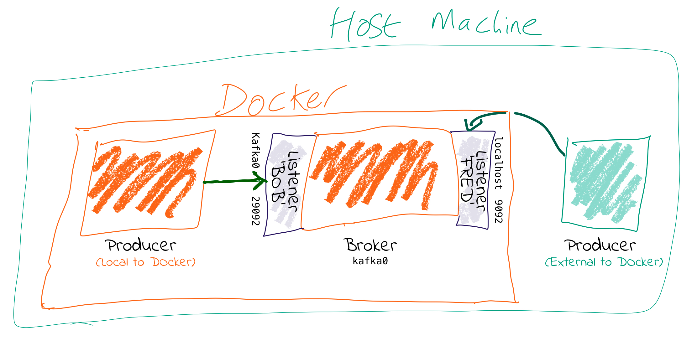

# Spark+Kafka构建实时分析Dashboard案例

学习的是[林子雨的Spark课程实验案例](https://dblab.xmu.edu.cn/post/spark-kafka-dashboard/)，用Docker搭建开发环境。


## container

[Marcel-Jan的项目](https://github.com/Marcel-Jan/docker-hadoop-spark)，整合了hadoop、spark、hive的docker环境，其他都正常，就是hive不会自动启动。
我修改了docker-compose.yml文件，编排了kafka的服务(这部分是copy的[kafka官方docker的例子](https://github.com/apache/kafka/blob/67fa3656cc4b8329c914ec3f255abae37adeca3c/docker/examples/docker-compose-files/single-node/plaintext/docker-compose.yml))。

**PS**

  - 在本地的`~/docker/spark/`目录下有volume:

    - spark容器中的家目录:复制jar包到家目录

    - spark的work目录:提交任务时的jar包、stderr和stdout

  - 启动`docker-compose up -d`


## spark: Spark应用

### 构建项目

#### sbt

- 教程

  - 视频

    [twitter 技术栈我来了，初试 scala 用 sbt 搭建 scala 环境(1)](https://www.bilibili.com/video/BV13d4y1a7qa)

  - 文档

    [sbt Reference Manual](https://www.scala-sbt.org/1.x/docs/)

- 问题

  - sbt镜像

    参看这篇文章：[sbt1.4.4配置国内镜像源实操教程（无痛入门）](https://blog.csdn.net/a772304419/article/details/111053781)

  - 依赖

    ```bash
    sbt:Simple Project> compile
    [error] stack trace is suppressed; run last update for the full output
    [error] (update) lmcoursier.internal.shaded.coursier.error.FetchError$DownloadingArtifacts: Error fetching artifacts:
    [error] file:/C:/Users/hunte/.m2/repository/org/slf4j/slf4j-api/1.7.30/slf4j-api-1.7.30.jar: not found: C:\Users\hunte\.m2\repository\org\slf4j\slf4j-api\1.7.30\slf4j-api-1.7.30.jar
    [error] file:/C:/Users/hunte/.m2/repository/org/apache/yetus/audience-annotations/0.5.0/audience-annotations-0.5.0.jar: not found: C:\Users\hunte\.m2\repository\org\apache\yetus\audience-annotations\0.5.0\audience-annotations-0.5.0.jar
    [error] Total time: 4 s, completed 2024-4-4 10:13:04
    ```

    用 maven 安装上对应版本的 jar 包就行，对应仓库地址：

    - [audience-annotations](https://mvnrepository.com/artifact/org.apache.yetus/audience-annotations)
    - [slf4j-api](https://mvnrepository.com/artifact/org.slf4j/slf4j-api)

  - 运行时缺少依赖

    防止运行时因为依赖出现问题，加载一个 sbt 的[plugin](https://www.scala-sbt.org/1.x/docs/Using-Plugins.html)：[sbt-assembly](https://github.com/sbt/sbt-assembly)

  - 提交的 spark 任务连接不上 kafka

    一个 6 年前的[blog](https://rmoff.net/2018/08/02/kafka-listeners-explained/)解决了我的问题，其中最重要的一张图片：

    

#### 测试

- [KafkaProducerTest](./src/main/scala/com/example/KafkaProducerTest.scala): 是一个生产者的测试

- [SimpleTest](./src/test/scala/com/example/SimpleTest.scala): 简单的单元测试

### 运行

- 打包

  ```bash
  # assembly插件
  sbt assembly
  ```

- 复制 jar 包和脚本到 spark 家目录（linux需要使用sudo）

  ```bash
  cp ./target/scala-2.12/simple-project-assembly-1.0.jar ~/docker/spark/
  cp ./startup.sh ~/docker/spark/
  ```

- 提交任务

  - 连接 docker 容器

    ```bash
    docker exec -it spark-master bash
    ```

  - 启动脚本

    ```bash
    sh /root/startup.sh
    ```


## flask: Web 应用和 Kafka 生产者的脚本

### 项目结构

- data目录存放的是用户日志数据；

  数据集压缩包为[data_format.zip](https://pan.baidu.com/s/1cs02Nc),该数据集压缩包是淘宝2015年双11前6个月(包含双11)的交易数据(交易数据有偏移，但是不影响实验的结果)，里面包含3个文件，分别是用户行为日志文件user_log.csv 、回头客训练集train.csv 、回头客测试集test.csv. 在这个案例中只是用user_log.csv这个文件，下面列出文件user_log.csv的数据格式定义：

    用户行为日志user_log.csv，日志中的字段定义如下：
    ```txt
    1. user_id | 买家id
    2. item_id | 商品id
    3. cat_id | 商品类别id
    4. merchant_id | 卖家id
    5. brand_id | 品牌id
    6. month | 交易时间:月
    7. day | 交易事件:日
    8. action | 行为,取值范围{0,1,2,3},0表示点击，1表示加入购物车，2表示购买，3表示关注商品
    9. age_range | 买家年龄分段：1表示年龄=50,0和NULL则表示未知
    10. gender | 性别:0表示女性，1表示男性，2和NULL表示未知
    11. province| 收获地址省份
    ```
    数据具体格式如下：
    ```csv
    user_id,item_id,cat_id,merchant_id,brand_id,month,day,action,age_range,gender,province
    328862,323294,833,2882,2661,08,29,0,0,1,内蒙古
    328862,844400,1271,2882,2661,08,29,0,1,1,山西
    328862,575153,1271,2882,2661,08,29,0,2,1,山西
    328862,996875,1271,2882,2661,08,29,0,1,1,内蒙古
    328862,1086186,1271,1253,1049,08,29,0,0,2,浙江
    328862,623866,1271,2882,2661,08,29,0,0,2,黑龙江
    328862,542871,1467,2882,2661,08,29,0,5,2,四川
    328862,536347,1095,883,1647,08,29,0,7,1,吉林
    ```

- scripts目录存放的是Kafka生产者和消费者；
  试用kafka连接是否正常
- static/js目录存放的是前端所需要的js框架；
- templates目录存放的是html页面；
- app.py为web服务器，接收Structed Streaming处理后的结果，并推送实时数据给浏览器；

### 环境配置

- 安装python

    python==3.7

- 创建并激活虚拟环境 (Optional)

    ```bash
    python -m .venv venv
    ./.venv/Scripts/activate
    ```

- 安装packages

    ```bash
    pip install -r requirements.txt
    ```

### 启动

- 提交spark任务

    [具体看这里](#运行)

- 启动生产者，模拟数据流

    `python scripts/producer.py`

- 启动app.py

    `python app.py`
